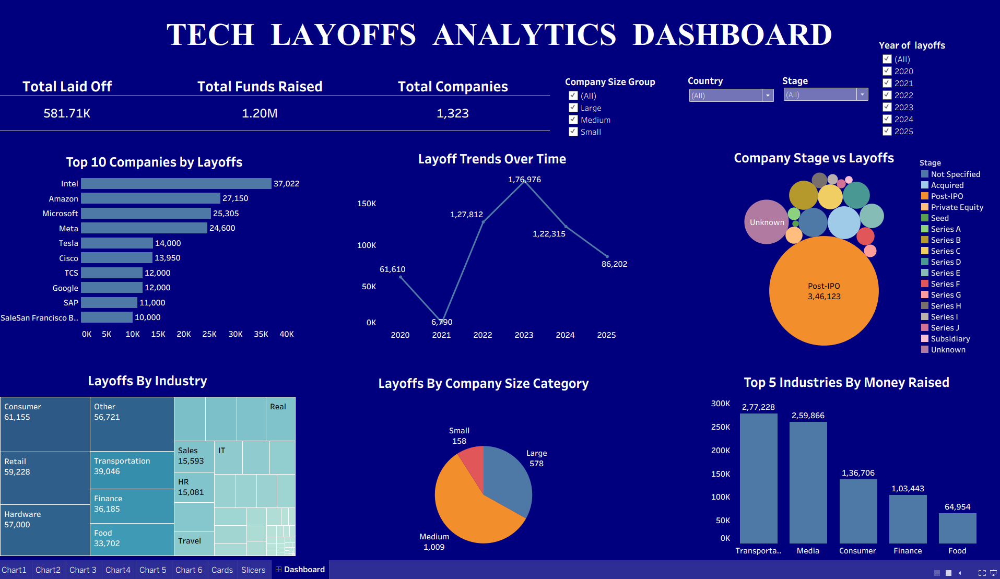

# Tech-Layoffs-Analysis
Analyzed tech layoffs data from 2022 to 2025 to identify layoff trends, industry patterns, funding stages, and key insights. Cleaned the data and created calculated fields and interactive Tableau visualizations to present meaningful insights.

## Project Overview

Analyzed tech layoffs data from 2022 to 2025 to identify layoff trends, industry patterns, funding stages, and key insights.

## Tools Used

- Tableau
- Data Cleaning
- Calculated Fields
- Data Visualization
- Dashboard Creation

## Dashboard

